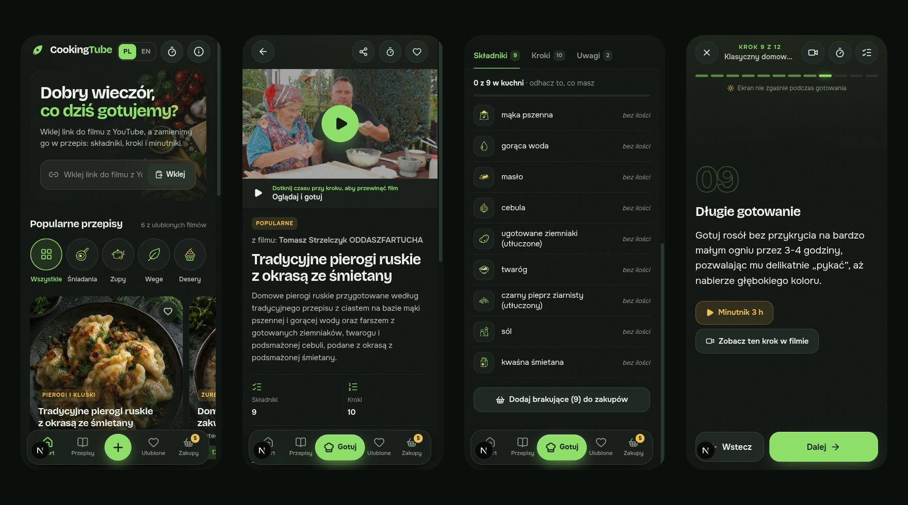
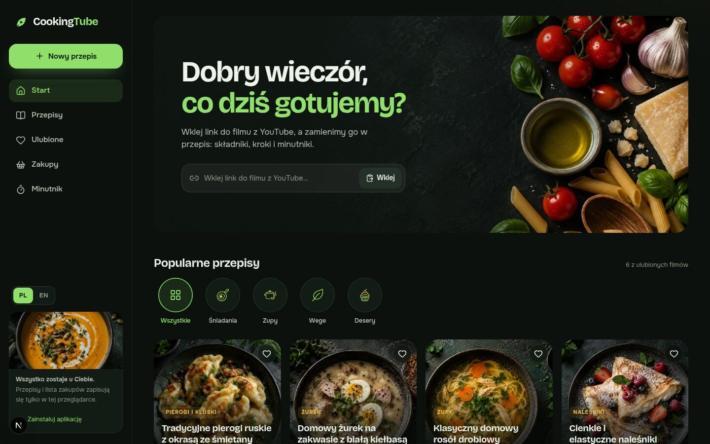
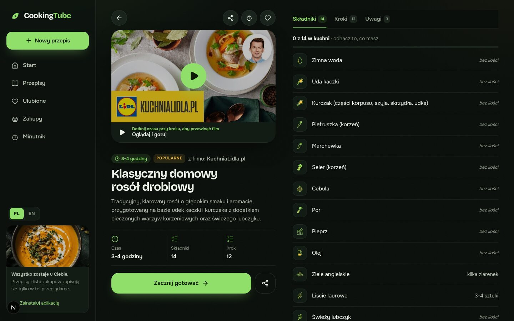
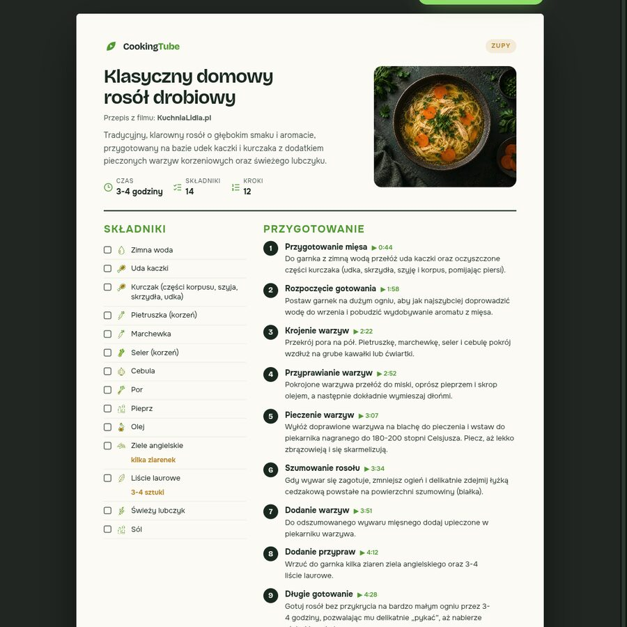
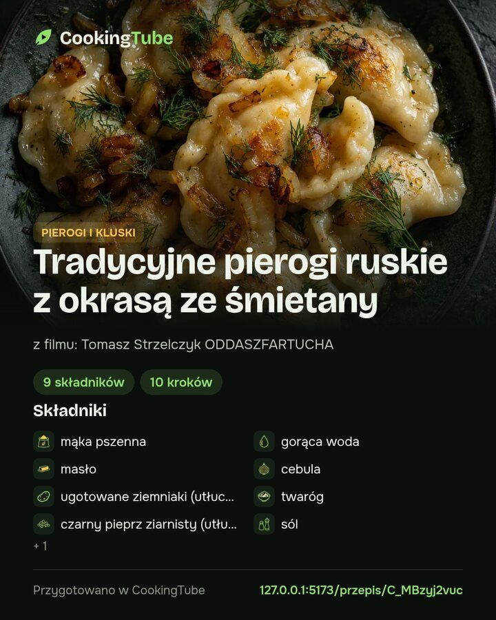

<p align="center">
  
</p>

<h1 align="center">CookingTube</h1>

<p align="center">
  <b>Turn any YouTube cooking video into a beautiful recipe — then cook along with the video.</b><br>
  Paste a link, give it a minute, and get the ingredients, the steps, timers and the exact moment in the video for every step.<br>
  In Polish 🇵🇱 or English 🇬🇧.
</p>

<p align="center">
  
  
  
  
  
</p>

<p align="center">
  
</p>

---

## Why you'll love it

- **🎬 From video to plate in about a minute.** Paste a YouTube link (Shorts too). AI watches and listens to the video and writes down every ingredient and step.
- **▶️ Watch & cook.** The video sits on top of the recipe. Every step has its timestamp, so one tap shows you exactly how the cook did it, and the step being played lights up.
- **👩‍🍳 A cooking mode built for messy hands.** One big step at a time, swipe or arrow keys, a screen that stays on, and the video clip for the current step.
- **⏱️ A real kitchen timer.** Durations in the steps ("8–10 minutes", "half an hour") become one-tap timers. Name them, run several at once, snooze with +1 min, and get a chime, a vibration and a notification when time's up.
- **🛒 A shopping list that writes itself.** Tick what you already have, and the rest goes to your list with one tap. Share or copy it on the way to the shop.
- **📄 Share it beautifully.** A printable PDF recipe card, Instagram-ready images (post and story), and links with rich previews on Facebook, X, WhatsApp, Messenger, Telegram, Pinterest, Threads and Reddit.
- **⭐ Popular recipes from day one.** Polish classics and favourite videos, prepared with the same AI pipeline and credited to their creators.
- **🌍 Polish & English.** One tap switches the interface; new recipes are generated in the language you use.
- **🔒 Yours, on your device.** Recipes, favourites, progress and the shopping list stay in your browser. No account needed.
- **🎨 Designed with care.** A dark kitchen art direction with 33 dish covers, 149 icons and food photography generated for this project.

## A look inside

<p align="center">
  
</p>
<p align="center">
  
</p>
<table>
  <tr>
    <td width="58%"></td>
    <td width="42%"></td>
  </tr>
  <tr>
    <td align="center"><sub>Printable PDF card</sub></td>
    <td align="center"><sub>Shareable image (4:5 and 9:16)</sub></td>
  </tr>
</table>

## How it works

1. **Check the video.** Gemini first checks that the video really shows one dish being cooked. Reviews, compilations and vlogs are politely declined.
2. **Write the recipe.** A second pass writes the recipe in the chosen language as structured JSON: title, ingredients, steps, notes and a timestamp for each step.
3. **Keep it honest.** A quantity stays only if the model can quote where the cook says it, and timestamps must be in order and inside the video. Anything uncertain is left blank rather than guessed.
4. **Make it delightful.** The app picks a dish cover, matches each ingredient to an icon, finds timers in the steps and links every step to its moment in the video.

## Quick start

```sh
npm ci
cp .env.example .env.local   # add your GEMINI_API_KEY
npm run dev                  # http://127.0.0.1:5173
```

| Command | What it does |
| --- | --- |
| `npm run dev` | Development server on port 5173 |
| `npm test` | Unit tests (pipeline, icons, timers, covers) |
| `npm run build` | Production build |
| `node --experimental-strip-types scripts/ingest-popular.mjs` | Prepares the popular recipes listed in `data/popular-videos.json` |

Deployment to Vercel or Cloudflare (Workers, D1, R2), the shared library, voting and all limits are described in the **[technical guide](docs/TECHNICAL.md)**.

## Under the hood

- **Next.js 16 + React 19**, TypeScript, plain CSS design tokens, self-hosted Onest and Bricolage Grotesque fonts.
- **Gemini** video understanding through the Interactions API; the key stays on the server.
- **Local-first data**: `useSyncExternalStore` stores for the library, progress, shopping list and timers, validated with Zod.
- **Watch & cook** with the YouTube IFrame API on `youtube-nocookie.com`, loaded only when you press play.
- **Canvas-rendered** share images and a print stylesheet for the PDF card.
- **PWA** with an offline fallback, plus optional Cloudflare storage for a shared, votable library.

```
app/            routes: home, recipe, cooking mode, PDF card, library, favourites, shopping, API
components/app  shell, generation, sheets, watch & cook, timer, sharing
components/screens  one file per screen
lib/            Gemini pipeline, local library, i18n, icons, timers, covers
data/           the curated list of popular videos
public/         fonts, icon sprites, covers and photography
```

## Popular recipes and their creators

The popular recipes are AI-written summaries of public videos. All credit for the cooking goes to their authors. Please watch, like and subscribe to them:

| Recipe | Creator | Video |
| --- | --- | --- |
| Tradycyjne pierogi ruskie z okrasą ze śmietany | Tomasz Strzelczyk ODDASZFARTUCHA | [watch](https://www.youtube.com/watch?v=C_MBzyj2vuc) |
| Domowy żurek na zakwasie z białą kiełbasą | SkutecznieTv | [watch](https://www.youtube.com/watch?v=JawgWAW1zno) |
| Klasyczny domowy rosół drobiowy | KuchniaLidla.pl | [watch](https://www.youtube.com/watch?v=RbfKeQG_3dQ) |
| Cienkie i elastyczne naleśniki | Menu Dorotki | [watch](https://www.youtube.com/watch?v=_iGj_Tz5A7k) |
| Tradycyjne placki ziemniaczane | Anka Gotuje | [watch](https://www.youtube.com/watch?v=9RZWpWJS_mg) |
| Puszysty i delikatny sernik | Orchideli | [watch](https://www.youtube.com/watch?v=vI6MFvxrRnU) |

More are queued in `data/popular-videos.json`. Run the ingest script again when your Gemini quota allows. Creators who would like a video removed can open an issue, and it will be taken down.

## Credits

- **Videos and recipes**: the creators listed above and on each recipe page. Videos stay on YouTube and play through YouTube's own player.
- **AI**: recipes are generated with Google Gemini. Photography, dish covers and icons were generated for this project with OpenAI's image model via Codex.
- **Fonts**: [Onest](https://github.com/simpals/onest) and [Bricolage Grotesque](https://github.com/ateliertriay/bricolage), SIL Open Font License 1.1 (see `public/fonts`).
- **Icons**: [Lucide](https://lucide.dev) (ISC) and brand glyphs from [Simple Icons](https://simpleicons.org) (CC0 1.0).

## License

CookingTube is released under the **[Apache License 2.0](LICENSE)**. You can use, change and share it, including commercially, as long as you keep the copyright notice and the **[NOTICE](NOTICE)** file, which credits the project. A visible "Based on CookingTube" with a link to this repository is warmly appreciated.

---

<details>
<summary><b>🇵🇱 Po polsku</b></summary>

**CookingTube zamienia film kulinarny z YouTube w piękny przepis, a potem pozwala gotować razem z filmem.**

Wklejasz link, czekasz chwilę i dostajesz składniki, kroki, minutniki oraz moment w filmie dla każdego kroku. Do tego:

- **Oglądaj i gotuj**: film nad przepisem, a dotknięcie czasu przy kroku przewija do tego momentu.
- **Tryb gotowania**: jeden duży krok naraz, gesty, ekran, który nie gaśnie, i fragment filmu dla bieżącego kroku.
- **Minutnik**: czasy z kroków jednym dotknięciem, kilka minutników naraz, dźwięk, wibracja i powiadomienie.
- **Lista zakupów**: odhacz, co masz w kuchni, a resztę dodasz jednym ruchem.
- **Udostępnianie**: karta PDF, grafiki na Instagram i linki z podglądem w mediach społecznościowych.
- **Popularne przepisy** z polskiej kuchni, z podziękowaniami dla autorów filmów.
- **PL / EN** jednym przełącznikiem. Dane zostają w przeglądarce, bez konta.

Start: `npm ci`, wpisz `GEMINI_API_KEY` do `.env.local`, potem `npm run dev`. Licencja Apache 2.0 z wymogiem zachowania pliku NOTICE (atrybucja).
</details>
