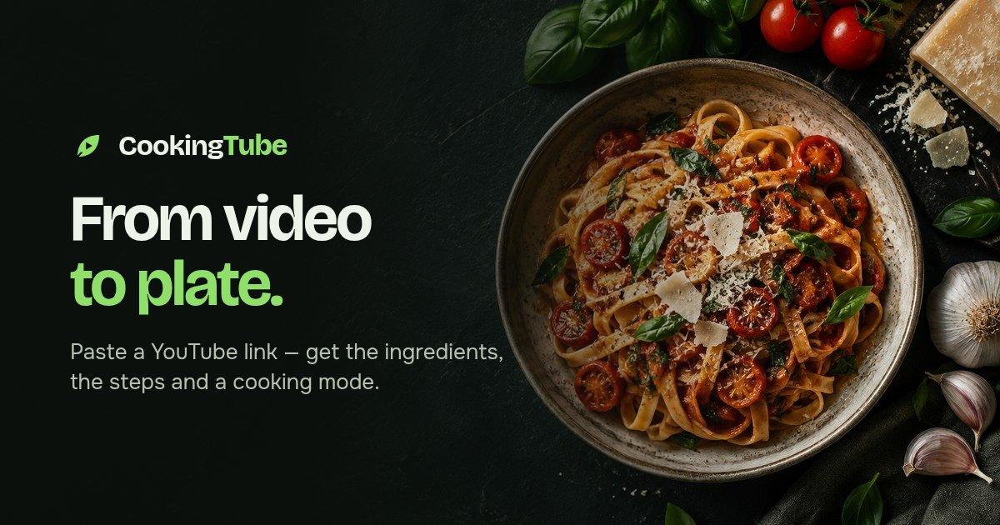
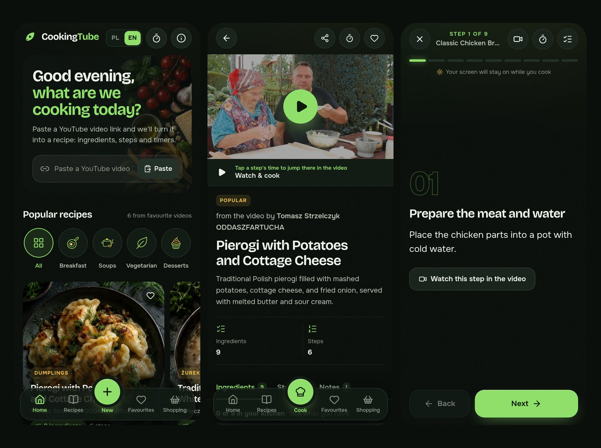
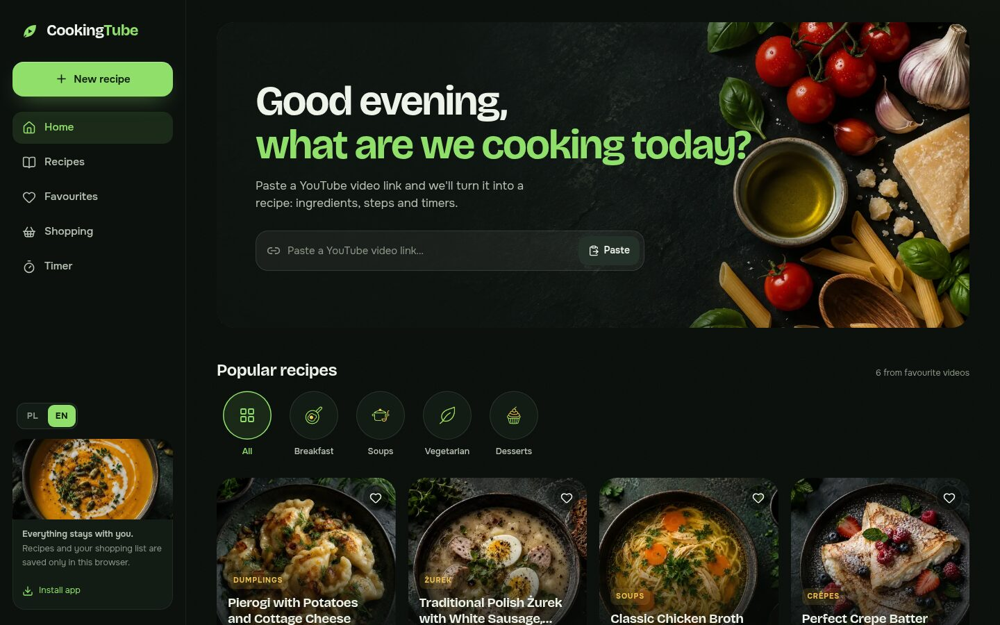
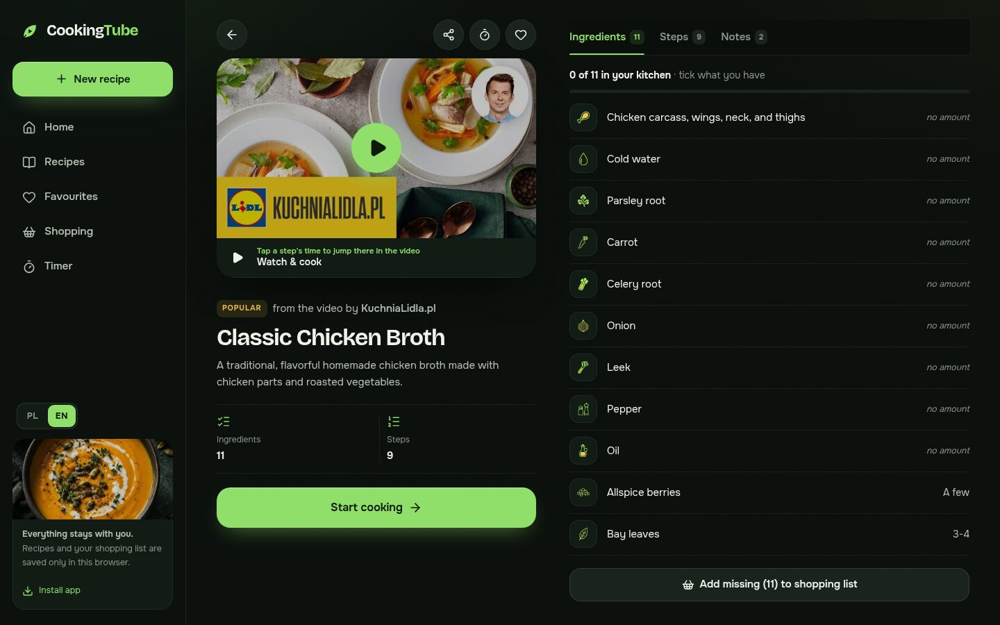
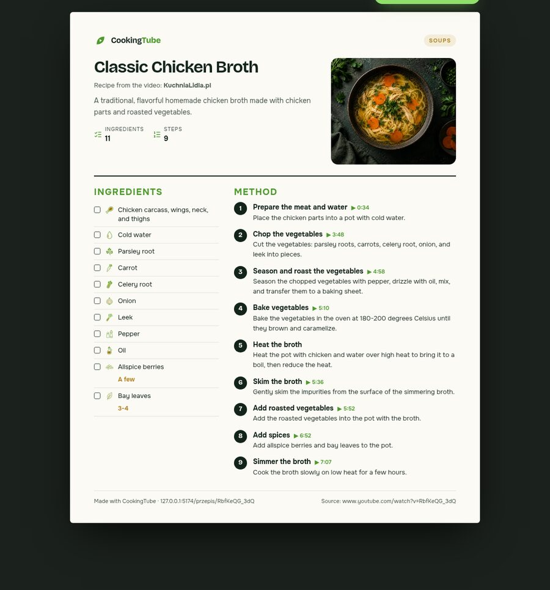
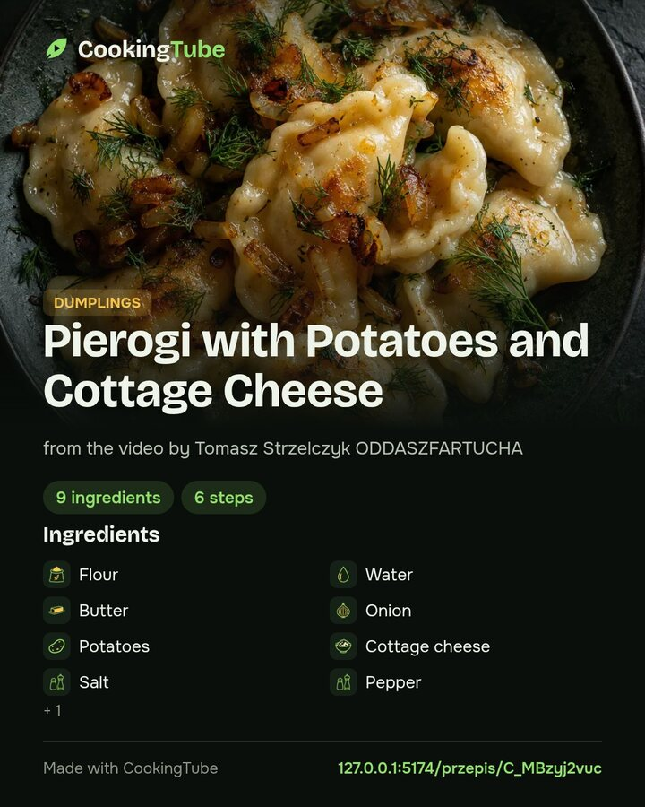

<p align="center">
  
</p>

<h1 align="center">CookingTube</h1>

<p align="center"><b>English</b> · <a href="README.pl.md">Polski</a></p>

<p align="center">
  <b>Turn any YouTube cooking video into a beautiful recipe — then cook along with the video.</b><br>
  Paste a link, give it a minute, and get the ingredients, the steps, timers and the exact moment in the video for every step.<br>
  In Polish 🇵🇱 or English 🇬🇧.
</p>

<p align="center">
  
  
  
  
  
</p>

<p align="center">
  
</p>

<p align="center">
  
</p>

---

## Why you'll love it

- **🎬 From video to plate in about a minute.** Paste a YouTube link (Shorts too). AI watches and listens to the video and writes down every ingredient and step.
- **▶️ Watch & cook.** The video sits on top of the recipe. Every step has its timestamp, so one tap shows you exactly how the cook did it, and the step being played lights up.
- **👩‍🍳 A cooking mode built for messy hands.** One big step at a time, swipe or arrow keys, a screen that stays on, and the video clip for the current step.
- **⏱️ A real kitchen timer.** Durations in the steps ("8–10 minutes", "half an hour") become one-tap timers. Name them, run several at once, snooze with +1 min, and get a chime, a vibration and a notification when time's up.
- **🛒 A shopping list that writes itself.** Tick what you already have, and the rest goes to your list with one tap. Share or copy it on the way to the shop.
- **📄 Share it beautifully.** A printable PDF recipe card, Instagram-ready images (post and story), and links with rich previews on Facebook, X, WhatsApp, Messenger, Telegram, Pinterest, Threads and Reddit.
- **⭐ Popular recipes from day one.** Polish classics and favourite videos, prepared with the same AI pipeline and credited to their creators.
- **🌍 Polish & English.** One tap switches the interface; new recipes are generated in the language you use.
- **🔒 Yours, on your device.** Recipes, favourites, progress and the shopping list stay in your browser. No account needed.
- **🎨 Designed with care.** A dark kitchen art direction with 33 dish covers, 149 icons and food photography generated for this project.

## A look inside

<p align="center">
  
</p>
<p align="center">
  
</p>
<table>
  <tr>
    <td width="58%"></td>
    <td width="42%"></td>
  </tr>
  <tr>
    <td align="center"><sub>Printable PDF card</sub></td>
    <td align="center"><sub>Shareable image (4:5 and 9:16)</sub></td>
  </tr>
</table>

## How it works

1. **Check the video.** Gemini first checks that the video really shows one dish being cooked. Reviews, compilations and vlogs are politely declined.
2. **Write the recipe.** A second pass writes the recipe in the chosen language as structured JSON: title, ingredients, steps, notes and a timestamp for each step.
3. **Keep it honest.** A quantity stays only if the model can quote where the cook says it, and timestamps must be in order and inside the video. Anything uncertain is left blank rather than guessed.
4. **Make it delightful.** The app picks a dish cover, matches each ingredient to an icon, finds timers in the steps and links every step to its moment in the video.

## Quick start

```sh
npm ci
cp .env.example .env.local   # add your GEMINI_API_KEY
npm run dev                  # http://127.0.0.1:5173
```

| Command | What it does |
| --- | --- |
| `npm run dev` | Development server on port 5173 |
| `npm test` | Unit tests (pipeline, icons, timers, covers) |
| `npm run build` | Production build |
| `node --experimental-strip-types scripts/ingest-popular.mjs` | Prepares the popular recipes listed in `data/popular-videos.json` |

## Learn more

- **[Technical guide](docs/TECHNICAL.md)**: deployment to Vercel or Cloudflare (Workers, D1, R2), the shared library, voting and limits.
- **[Architecture](docs/ARCHITECTURE.md)**: how the interface, local data, watch & cook, timers and sharing are built.
- **[Credits](CREDITS.md)**: the creators behind the popular recipes, fonts, icons and AI.

## License

[Apache License 2.0](LICENSE). Keep the [NOTICE](NOTICE) with its credit when you share or build on CookingTube.
