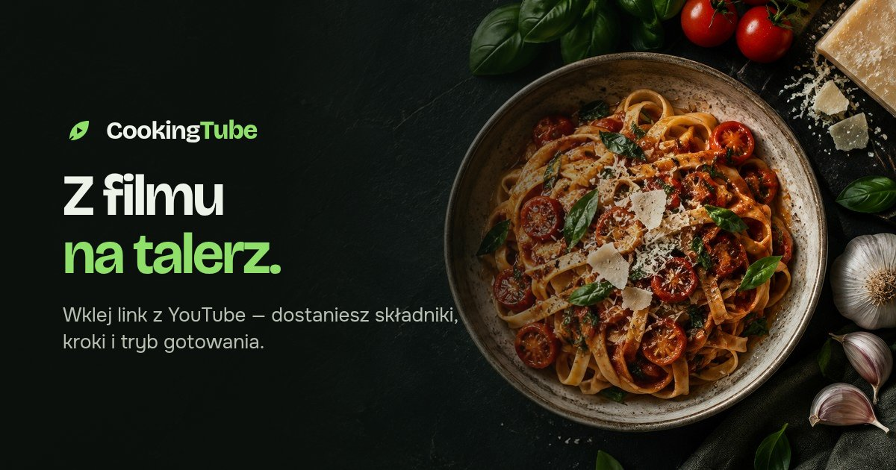
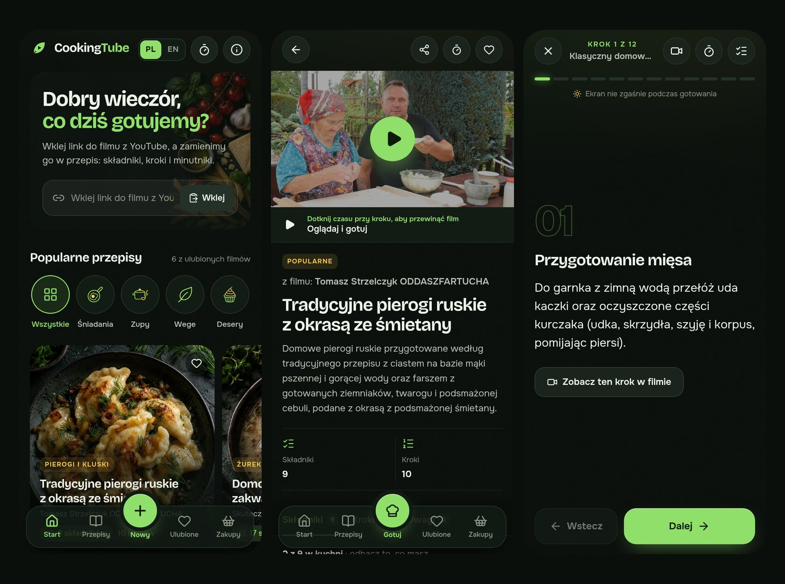
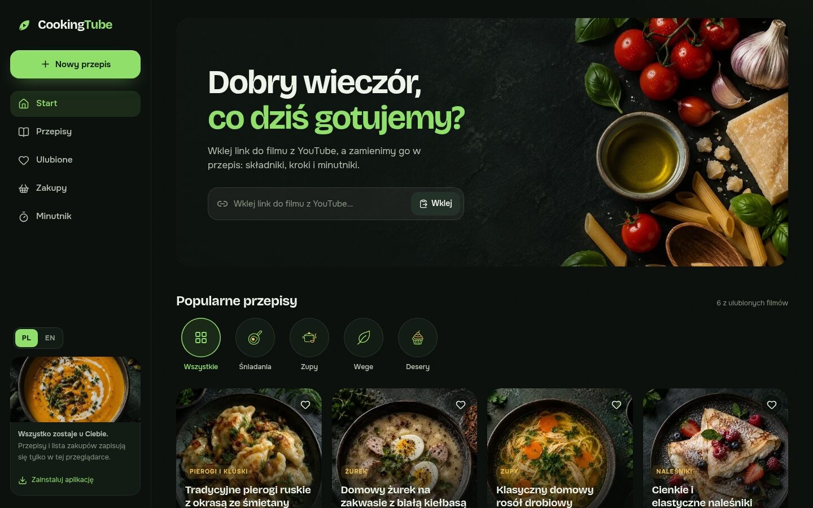
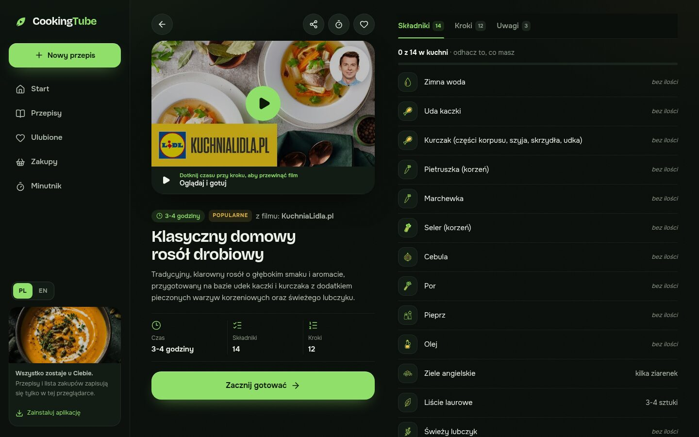
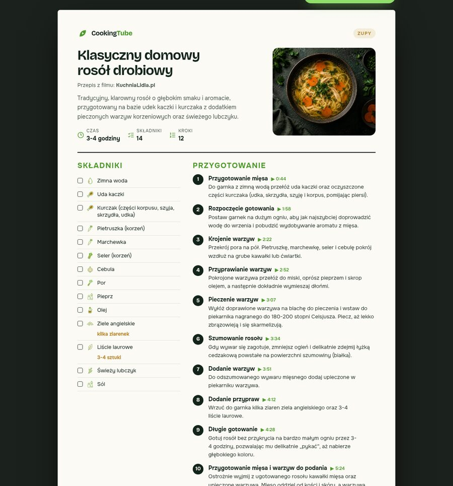
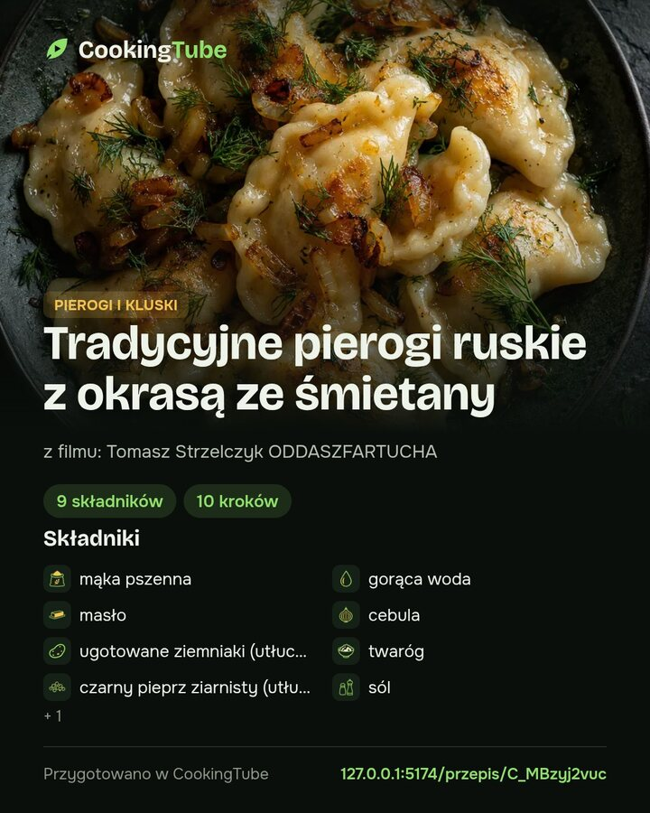

<p align="center">
  
</p>

<h1 align="center">CookingTube</h1>

<p align="center"><a href="README.md">English</a> · <b>Polski</b></p>

<p align="center">
  <b>Zamień dowolny film kulinarny z YouTube w piękny przepis — i gotuj razem z filmem.</b><br>
  Wklej link, daj nam chwilę i dostań składniki, kroki, minutniki oraz dokładny moment w filmie dla każdego kroku.<br>
  Po polsku 🇵🇱 albo po angielsku 🇬🇧.
</p>

<p align="center">
  
  
  
  
  
</p>

<p align="center">
  
</p>

<p align="center">
  
</p>

---

## Za co go polubisz

- **🎬 Z filmu na talerz w około minutę.** Wklej link z YouTube (także Shorts). AI ogląda i słucha filmu, a potem spisuje każdy składnik i każdy krok.
- **▶️ Oglądaj i gotuj.** Film jest nad przepisem. Każdy krok ma swój moment w filmie, więc jedno dotknięcie pokazuje, jak dokładnie zrobił to kucharz, a krok, który właśnie leci, się podświetla.
- **👩‍🍳 Tryb gotowania na brudne ręce.** Jeden duży krok naraz, przesuwanie palcem lub strzałki, ekran, który nie gaśnie, i fragment filmu dla bieżącego kroku.
- **⏱️ Prawdziwy minutnik kuchenny.** Czasy z kroków („8–10 minut”, „pół godziny”) zamieniają się w minutniki jednym dotknięciem. Nazwij je, uruchom kilka naraz, przedłuż o minutę i usłysz dźwięk, poczuj wibrację, zobacz powiadomienie, gdy czas minie.
- **🛒 Lista zakupów, która pisze się sama.** Odhacz to, co masz w kuchni, a resztę dodasz do listy jednym ruchem. Udostępnij ją albo skopiuj w drodze do sklepu.
- **📄 Piękne udostępnianie.** Karta przepisu do druku i PDF, grafiki gotowe na Instagram (post i relacja) oraz linki z podglądem na Facebooku, X, WhatsAppie, Messengerze, Telegramie, Pintereście, Threads i Reddicie.
- **⭐ Popularne przepisy od pierwszego dnia.** Polskie klasyki i ulubione filmy, przygotowane tym samym procesem AI i podpisane nazwiskami ich twórców.
- **🌍 Polski i angielski.** Jedno dotknięcie zmienia język interfejsu, a nowe przepisy powstają w języku, którego używasz.
- **🔒 Twoje, na Twoim urządzeniu.** Przepisy, ulubione, postępy i lista zakupów zostają w przeglądarce. Bez zakładania konta.
- **🎨 Zaprojektowane z dbałością.** Ciemna, kuchenna stylistyka z 33 okładkami potraw, 149 ikonami i zdjęciami jedzenia wygenerowanymi dla tego projektu.

## Zajrzyj do środka

<p align="center">
  
</p>
<p align="center">
  
</p>
<table>
  <tr>
    <td width="58%"></td>
    <td width="42%"></td>
  </tr>
  <tr>
    <td align="center"><sub>Karta przepisu do druku i PDF</sub></td>
    <td align="center"><sub>Grafika do udostępnienia (4:5 i 9:16)</sub></td>
  </tr>
</table>

## Jak to działa

1. **Sprawdzamy film.** Gemini najpierw upewnia się, że film naprawdę pokazuje przygotowanie jednej potrawy. Recenzje, kompilacje i vlogi grzecznie odpadają.
2. **Spisujemy przepis.** Drugi przebieg tworzy przepis w wybranym języku jako uporządkowany JSON: tytuł, składniki, kroki, uwagi i moment w filmie dla każdego kroku.
3. **Zostajemy uczciwi.** Ilość zostaje tylko wtedy, gdy model potrafi zacytować, gdzie autor ją podał, a momenty kroków muszą być po kolei i mieścić się w filmie. Wszystko niepewne zostaje puste, zamiast być zgadywane.
4. **Dodajemy radości.** Aplikacja dobiera okładkę potrawy, dopasowuje ikonę do każdego składnika, znajduje minutniki w krokach i łączy każdy krok z jego momentem w filmie.

## Szybki start

```sh
npm ci
cp .env.example .env.local   # wpisz GEMINI_API_KEY
npm run dev                  # http://127.0.0.1:5173
```

| Polecenie | Co robi |
| --- | --- |
| `npm run dev` | Serwer deweloperski na porcie 5173 |
| `npm test` | Testy (proces AI, ikony, minutniki, okładki) |
| `npm run build` | Build produkcyjny |
| `node --experimental-strip-types scripts/ingest-popular.mjs` | Przygotowuje popularne przepisy z listy `data/popular-videos.json` |

## Więcej

- **[Przewodnik techniczny](docs/TECHNICAL.md)** (EN): wdrożenie na Cloudflare (Workers, D1, R2), wspólna biblioteka, głosowanie i limity.
- **[Architektura](docs/ARCHITECTURE.md)** (EN): jak zbudowane są interfejs, dane lokalne, „oglądaj i gotuj”, minutniki i udostępnianie.
- **[Podziękowania](CREDITS.md)** (EN): twórcy popularnych przepisów, fonty, ikony i AI.

## Licencja

[Apache License 2.0](LICENSE). Zachowaj plik [NOTICE](NOTICE) z atrybucją, gdy udostępniasz CookingTube albo budujesz na jego podstawie.
